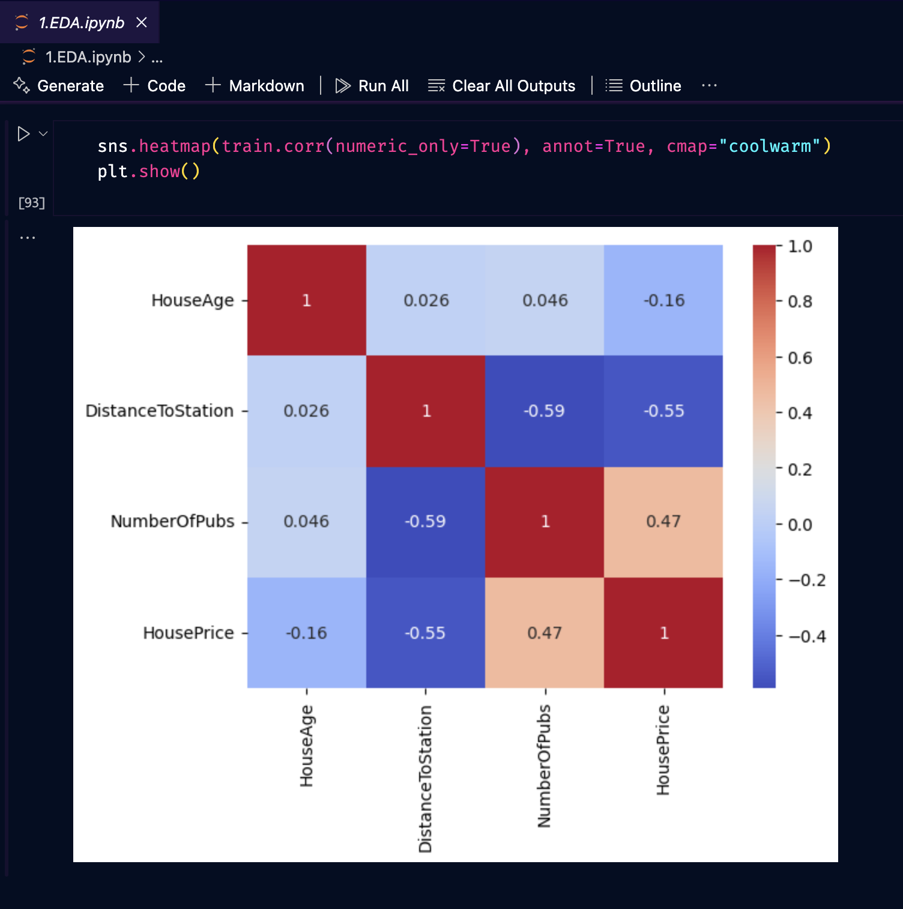
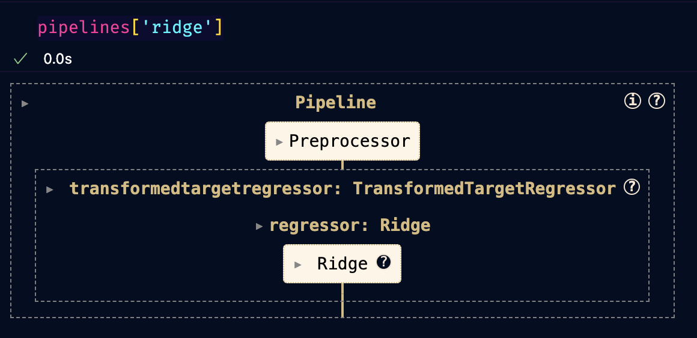
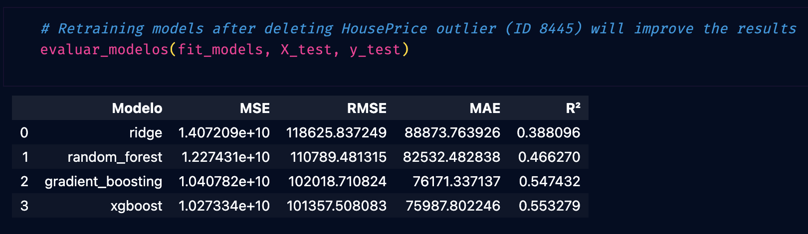
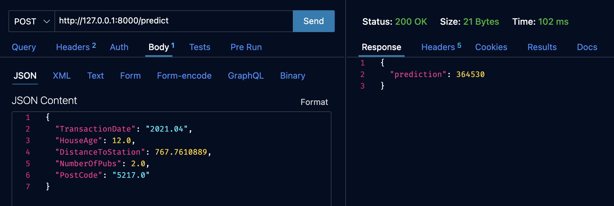

# House Price Prediction API 🚀

1. **Exploratory Data Analysis (EDA)** and data cleaning

2. **Model Selection** using multiple regressors (e.g., Ridge, RandomForest, GradientBoosting, XGBoost)

3. **Metrics Calculation** for each model

4. **API** to serve predictions

